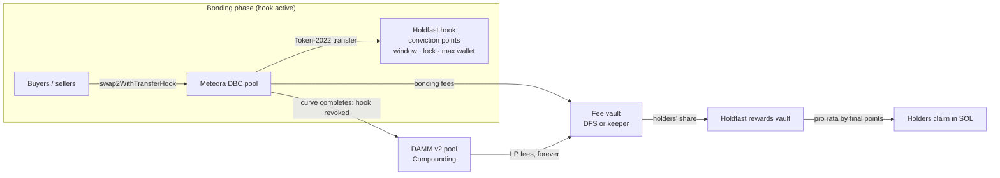

# Holdfast

**Launches that reward the people who stay.**

Holdfast is a plug-in conviction layer for [Meteora Dynamic Bonding Curve](https://docs.meteora.ag/core-products/dbc/what-is-dbc) launches. A Token-2022 transfer hook scores every holder by *how much × how long* they hold. It blocks snipe-and-dump in the first minutes, and it turns that score into a perpetual share of the launch's trading fees: first from the bonding curve, then, after graduation, from the DAMM v2 pool.

- **Live app (devnet):** https://hold-fast-mauve.vercel.app
- **Program (devnet):** [`E5AkJh1QFPsVTBf6E3Z9MfUWENtb82TGK1hoytkKTEGw`](https://explorer.solana.com/address/E5AkJh1QFPsVTBf6E3Z9MfUWENtb82TGK1hoytkKTEGw?cluster=devnet)
- **Demo video:** _link to be added_
- **Repo:** https://github.com/OxTEJIRI/Holdfast

> **On devnet, rewards were split through a keeper, not Dynamic Fee Sharing.** Devnet's DFS build is missing a whitelist entry that hook pools need, so the creator's wallet claimed the fees and deposited the holders' share. The trustless DFS path is tested against mainnet's program binaries. Details under [Fee modes](#built-deep-into-meteora).

> A *holdfast* is the root-like anchor that keeps kelp fixed to the rock while the tide pulls.

## The problem

On a bonding-curve launch the people who make money are the fastest, not the most committed. Snipers buy in the first seconds and dump on the first real buyers. Bundlers spray fresh wallets to dodge limits. Flippers churn in and out. The holders who stay, and give the token its value, get nothing for staying.

## What Holdfast does

1. **Scores conviction.** Every transfer updates the holder's points: `tracked balance × seconds held`. Selling 30% of your bag forfeits 30% of your points; selling everything resets you to zero. Moving tokens to another wallet forfeits them too. Points are linear in balance, so splitting a bag across wallets gains nothing.
2. **Protects the opening minutes.** During a short opening window:
   - only registered wallets can receive tokens, which stops bundling into fresh wallets;
   - an optional max-wallet cap applies;
   - anything bought is snipe-locked for a while.
3. **Pays the people who stayed.** At graduation conviction is frozen. Every fee the launch earns from then on goes out to holders pro rata by final points: bonding-curve fees first, then DAMM v2 LP fees for as long as the token trades. Holders claim in SOL.

### Proof: the Arena

27 bots ran one real launch on devnet. The run was recorded and can be replayed at [/arena](https://hold-fast-mauve.vercel.app/arena); the full results are in [docs/arena/devnet](docs/arena/devnet/README.md).

| Persona | Behaviour | Blocked by Holdfast | Rewards per SOL invested |
|---|---|---|---:|
| Holders (10) | small buys, never sell | none | **35.9 mSOL** |
| Whale (1) | tries to take 8% in the window, buys after it | `MaxWalletExceeded` ×1 | 50.3 mSOL |
| Snipers (3) | buy at t+2 s, dump at the first chance | `SnipeLocked` ×24 | **0** |
| Bundler (1 + 5 fresh wallets) | buys into unregistered wallets | `RecipientNotRegistered` ×5 | 0 |
| Flippers (6) | in and out within 30–90 s | none | **0** |

**Why the whale earned the most per SOL:** it was blocked in the window, bought after it, then held. Conviction paid it for holding. Selling would have zeroed it.

Snipers and flippers still sold for more than they paid: Holdfast doesn't stop profit-taking. What it changes is who earns the fee stream, and that went entirely to the wallets that stayed.

## Provably not a honeypot

A transfer hook *can* block sales, so Holdfast bounds that power in the program itself:

- Every rule is fixed at launch, and each has a hard cap enforced on-chain:
  - opening window ≤ 10 min;
  - snipe-lock ≤ 30 min;
  - max wallet either off or ≥ 0.5%.
- The hook can reject a transfer in exactly three ways: `RecipientNotRegistered` and `MaxWalletExceeded` only during the window, and `SnipeLocked` only for tokens bought in the window and only until their lock ends.
- So **after `launch + window + lock` (40 minutes worst case) the hook cannot reject any transfer.** All accounting saturates instead of erroring.
- At graduation Meteora's DBC program **revokes the hook entirely**, and the token becomes a plain Token-2022 token that trades anywhere.

The token page shows the exact moment for every launch.

## Built deep into Meteora

| Meteora program | How Holdfast uses it |
|---|---|
| **Dynamic Bonding Curve** | Transfer-hook pools (Token-2022), `createConfigWithTransferHook`, `swap2WithTransferHook`, the exponential anti-sniper fee scheduler, dynamic fees, `claimPartnerTradingFee2`, curve completion revoking the hook |
| **DAMM v2** | Graduation via `migrateToDammV2` into a **Compounding** pool. The partner LP is permanently locked and owned by the fee claimer, so its LP fees flow to holders forever. The creator's LP vests. |
| **Dynamic Fee Sharing** (mainnet mode; devnet uses a keeper, see below) | A PDA fee vault is the DBC fee claimer. It splits fees between the Holdfast rewards PDA (holders), the creator and the treasury, and is funded by `fund_by_claiming_fee` from DBC and DAMM v2. `sync_rewards` CPIs `claim_fee` signed by the rewards PDA. |
| **Token-2022** | The Holdfast program is the mint's transfer hook (its extra accounts are key-seeded PDAs). |

**Fee modes.** The devnet build of Dynamic Fee Sharing does not whitelist DBC `claim_trading_fee2`, which hook pools need; mainnet's build does ([docs/VERIFICATION.md](docs/VERIFICATION.md), V6). So **everything on devnet, including the Arena and the live app, splits rewards through a keeper**: the creator's wallet is the fee claimer and deposits the holders' share with `deposit_rewards`. The fully trustless DFS mode (`sync_rewards`) is proven end to end against the mainnet program binaries in the test suite, and it is what a mainnet launch uses.

**Program IDs.**

| Program | Address |
|---|---|
| Holdfast (devnet) | `E5AkJh1QFPsVTBf6E3Z9MfUWENtb82TGK1hoytkKTEGw` |
| Meteora Dynamic Bonding Curve | `dbcij3LWUppWqq96dh6gJWwBifmcGfLSB5D4DuSMaqN` |
| Meteora DAMM v2 | `cpamdpZCGKUy5JxQXB4dcpGPiikHawvSWAd6mEn1sGG` |
| Meteora Dynamic Fee Sharing | `dfsdo2UqvwfN8DuUVrMRNfQe11VaiNoKcMqLHVvDPzh` |

## Integrate it: three calls

```ts
import { createLaunch, buy, crank, claim } from '@holdfast/sdk'

const launch = await createLaunch(conn, { creator, treasury, name, symbol, uri, preset: 'fairLaunch', network: 'mainnet' })
for (const step of launch.steps) await signAndSend(await step.build(), step.signers)

await signAndSend(await buy(conn, { owner, mint: launch.mint, solIn: 0.1 }))      // registers on first buy

for (const tx of await crank(conn, { mint, signer: creator })) await signAndSend(tx) // after graduation
await signAndSend(await claim(conn, { owner, mint }))
```

The SDK ([packages/sdk](packages/sdk/README.md)) also provides:
- presets: Fair Launch, Slow Burn, Arena;
- the leaderboard, plus live `projectedShare` and `claimable`;
- `explainError`, which turns a failure into text like "Snipe-locked until 14:32:05".

## How it works (short)



Details are in [docs/ARCHITECTURE.md](docs/ARCHITECTURE.md): accounts, the hook algorithm, the reward accumulator and the launch transaction sequence.

## Run it

Prerequisites: WSL2/Linux, Rust, Solana CLI (Agave 4.x), Anchor 1.2, Node ≥ 22.12, pnpm ≥ 10.

```bash
pnpm install
scripts/fetch-fixtures.sh            # Meteora DBC / DFS / DAMM v2 binaries from mainnet → fixtures/
pnpm test                            # Rust unit + SDK + integration tests on a local validator with the real Meteora programs
pnpm -C apps/web dev                 # the web app (devnet), http://localhost:3000
RPC_URL=https://api.devnet.solana.com pnpm create-launch --preset fairLaunch --name "My Token" --symbol MYT --uri https://…
pnpm -C sim fund && pnpm -C sim arena --speed 2      # the Arena (see sim/README.md for RPC settings)
```

**Tests:**
- 15 Rust unit tests: the math, including overflow at max supply × max duration and a 256-bit oracle.
- 13 offline SDK tests: every preset passes the DBC SDK's own config validation.
- 48 integration tests on a local validator running the **real** Meteora programs:
  - all 12 cases from the design spec;
  - keeper and DFS fee modes;
  - every preset launching on DBC;
  - forged-account and hidden-bag security regressions.
- A browser end-to-end run on devnet: launch → buy → conviction grows → snipe-locked → graduate → claim → migrate (`apps/web/e2e`, screenshots in `docs/screens`).

## Repository

```
programs/holdfast   Anchor program: transfer hook, conviction accounting, rewards
packages/sdk        @holdfast/sdk
apps/web            Next.js app (token page, Arena, launch wizard, developers)
sim                 the Arena simulation
tests               integration tests (real Meteora programs on a local validator)
scripts             local validator, fixtures, create-launch, e2e
docs                VERIFICATION (Phase 0 findings), ARCHITECTURE, SECURITY, arena run, e2e records, screenshots
DESIGN.md           the original design spec · PROGRESS.md: build log and decisions
```

## Known limitations

- **Bonding-phase trading needs Holdfast-aware clients.** Holder records are keyed by token-account address. The stock DBC SDK resolves hook accounts with placeholder keys, so plain DBC-SDK swaps of a Holdfast token fail during the bonding phase. Trade through `@holdfast/sdk` (or apply its `patchHookAccounts`). Aggregators may not route hook tokens. After graduation the hook is gone and the token trades anywhere.
- **Only registered wallets earn.** Tokens held in unregistered accounts earn nothing. Registration happens automatically on a buyer's first buy through the SDK.
- **Keeper mode trusts the keeper.** On devnet the creator's wallet deposits the holders' share. The DFS mode used on mainnet removes that trust.
- **DFS cranks need a shareholder signer.** In DFS mode, pulling fees from Meteora into the vault needs a shareholder's signature (creator or treasury). `sync_rewards` itself is permissionless.
- **Not audited.** This is a devnet demonstration. The program has an upgrade authority; make it immutable before any mainnet use. See [docs/SECURITY.md](docs/SECURITY.md).

## License

ISC
