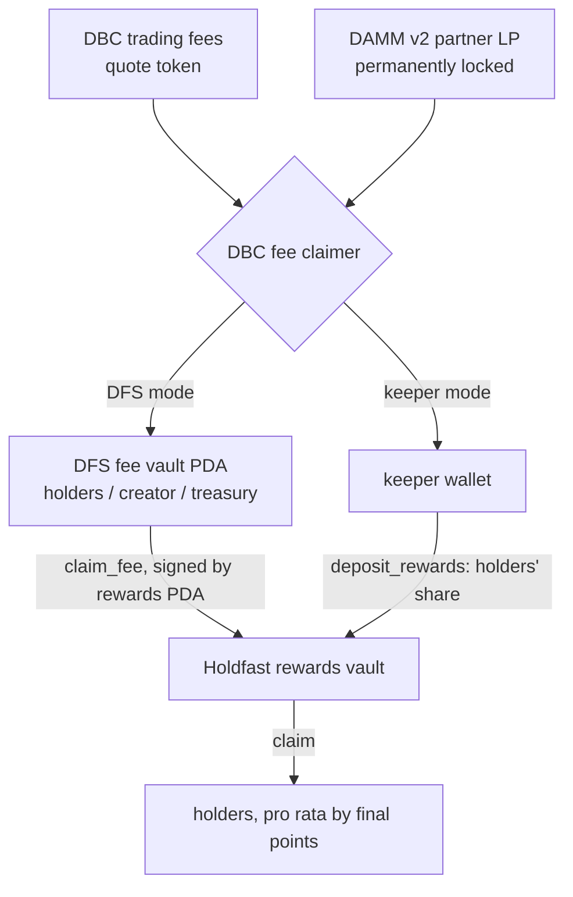
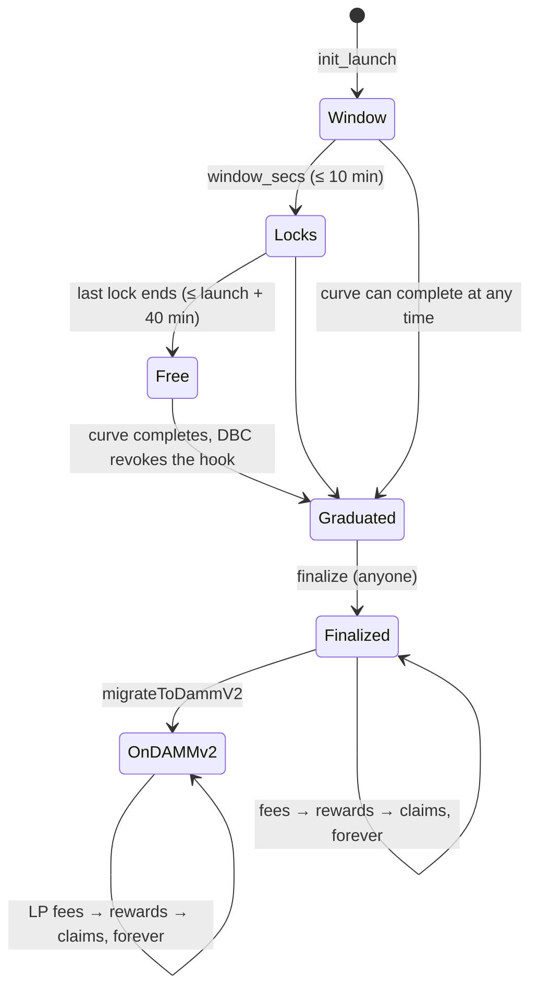

# Architecture

## Programs and accounts

Holdfast is one Anchor program (`programs/holdfast`, devnet `E5AkJh1QFPsVTBf6E3Z9MfUWENtb82TGK1hoytkKTEGw`). It sits beside Meteora's programs and never takes custody of trading liquidity.

| Account | Seeds | Holds |
|---|---|---|
| `Launch` | `["launch", mint]` | DBC pool and config, creator, fee vault (or `default` in keeper mode), rules (window, lock, max wallet), totals (`total_tracked`, `total_points`), finalization (`final_ts`, `final_total_points`) and the reward accumulator (`acc_reward_per_point`, in/out totals) |
| `Holder` | `["holder", token_account]` | owner, `tracked_balance`, `points`, `last_ts`, `unlock_ts`, `final_points`, `reward_debt`, `claimed` |
| ExtraAccountMetaList | `["extra-account-metas", mint]` | what Token-2022 passes to the hook: `launch`, `["holder", source]`, `["holder", destination]` |
| Rewards authority | `["rewards", mint]` | signer for the rewards vault; shareholder #0 of the DFS fee vault |
| Rewards vault | `["rewards_vault", mint]` | quote-token (wSOL) account holders are paid from |

Holder records are keyed by the token-account **address**, never its data. That makes the hook's extra accounts deterministic, even for a first-time buyer whose token account doesn't exist yet when the swap is built (design spec §5.3). `register` only accepts the owner's Token-2022 associated token account, so there is one record per wallet, with an immutable owner.

## Instructions

| Instruction | Who | What |
|---|---|---|
| `init_launch(params)` | pool creator | Runs in the same transaction as DBC pool creation. It checks: param caps; that the mint's hook is Holdfast; a fixed supply (no mint authority); that the DBC pool and config belong to this mint; that the signer is the pool's creator; the quote mint; and, in DFS mode, that the fee vault is the DBC fee claimer. It then creates the launch, the meta list and the rewards vault. |
| `register` | holder | Idempotent. Creates the holder record for the owner's ATA, seeding `tracked_balance` with the current balance. Closed once the hook is revoked. |
| `execute(amount)` | Token-2022 | The transfer hook (below). |
| `finalize` | anyone | Requires the curve to be complete (`finish_curve_timestamp`, or the hook revoked). Accrues global points to `final_ts` and freezes them. |
| `sync_rewards(index)` | anyone (DFS mode) | CPIs DFS `claim_fee`, signed by the rewards PDA, then distributes whatever the vault received. |
| `deposit_rewards(amount)` | anyone (keeper mode) | Transfers quote into the vault, then distributes. |
| `claim` | holder owner | Pays `floor(final_points × acc / 2^64) − reward_debt`, capped at the vault balance. |

## The hook (`execute`)

```
require: source is a Token-2022 account mid-transfer, for this mint
accrue the global total to now
is_buy  = source owner == DBC pool authority
is_sell = destination owner == DBC pool authority
in_window = now < launch_ts + window_secs

if the source has a record:
    require now ≥ source.unlock_ts                  → SnipeLocked
    accrue the source; forfeit points × min(amount, balance) / balance; reduce its balance
if not a sell:
    if the destination has a record: accrue, add amount, and if in_window extend its lock to now + snipe_lock_secs
    else if in_window:                               → RecipientNotRegistered
    if in_window and max wallet on: require destination balance ≤ cap → MaxWalletExceeded
emit HookEvent
```

The cost is about 12.6k compute units per transfer, against a 30k budget. Token-2022 re-resolves the meta list against the real source and destination, so a caller cannot substitute a different holder record (see SECURITY.md).

## Rewards

At graduation each record's final points are `points + tracked_balance × (final_ts − last_ts)`, and the global total is computed the same way. Rewards use the classic reward-per-share accumulator in Q64.64:

```
acc_reward_per_point += (new_rewards << 64) / final_total_points      (rounded down)
owed(holder)          = (final_points × acc_reward_per_point >> 64) − reward_debt   (256-bit intermediate, rounded down)
```

Whatever reaches the rewards vault beyond what is already owed (DFS claims, keeper deposits) is distributed by the next `sync_rewards` or `deposit_rewards`. Rounding always favours the vault: tests check that claims never exceed what was added and fall short of pro rata by less than one lamport per round.

### Fee flow



## Launch transaction sequence

1. **DFS mode only:** `initialize_fee_vault_pda`, with base = the DBC config keypair and shareholders = rewards PDA, creator, treasury.
2. `createConfigWithTransferHook`, with fee claimer = the DFS vault or the keeper.
3. `createPoolWithTransferHook` → Holdfast `init_launch` → creator ATA + `register`, in one transaction (≈1,155 of 1,232 bytes).
4. Optional: the creator's first buy.

The SDK returns these as builders, because the DBC SDK reads the config account from chain when it builds step 3.

## Lifecycle


