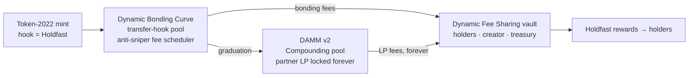

# Holdfast: pitch deck

Eight slides. Each has its on-slide content, then speaker notes.

---

## 1 · The problem

**Launches pay the fastest, not the most committed.**

- Snipers buy in the first second and dump on real buyers.
- Bundlers spray fresh wallets to dodge limits.
- Flippers churn in and out.
- The holders who give a token its value earn nothing for staying.

> Notes: Everyone in the room has watched a launch get sniped. The issue isn't price. It's that the reward for being early-and-gone is bigger than the reward for staying.

---

## 2 · The insight

**Make holding time a provable, on-chain claim on the launch's cash flows.**

- Conviction = **how much × how long** you hold.
- Your share of every fee the launch ever earns = your share of conviction.
- Selling 30% of your bag forfeits 30% of your points. Selling everything resets you to zero.

> Notes: A *holdfast* is the root that keeps kelp anchored while the tide pulls. We're giving holders a root.

---

## 3 · How it works

1. **Launch:** a normal Meteora DBC launch on a Token-2022 mint whose transfer hook is Holdfast. One extra instruction in the creation transaction.
2. **Hold:** every transfer updates points (balance × seconds). In the opening window only registered wallets can receive tokens, a max-wallet cap applies, and buys are snipe-locked.
3. **Get paid:** at graduation conviction freezes. Bonding-curve fees, then DAMM v2 LP fees, flow to holders pro rata, forever. They claim in SOL.

> Notes: Points are linear in balance, so splitting across wallets gains nothing, and moving tokens between wallets forfeits points.

---

## 4 · Provably not a honeypot

| | Hard cap (in the program) |
|---|---|
| Opening window | ≤ 10 minutes |
| Snipe-lock | ≤ 30 minutes |
| Max wallet | off, or ≥ 0.5% |

- After **launch + window + lock (40 minutes worst case) the hook cannot reject any transfer.** All accounting saturates instead of erroring.
- At graduation **Meteora's DBC revokes the hook entirely.**
- The rules are fixed at launch and can't be changed.

> Notes: This is the objection every judge should have about a transfer hook. Our answer is in the code, and the fuzz test runs 60 random trades after the window to prove nothing is ever rejected.

---

## 5 · Built deep into Meteora



- DBC: `createConfigWithTransferHook`, `swap2WithTransferHook`, the exponential fee scheduler, dynamic fees, `claimPartnerTradingFee2`, hook revocation at completion.
- DAMM v2: `migrateToDammV2` in Compounding mode; the partner LP is owned by the fee vault.
- Dynamic Fee Sharing: a PDA vault as the DBC fee claimer, `fund_by_claiming_fee`, `claim_fee` signed by our PDA.

> Notes: Every Meteora program here is load-bearing. Remove any one and holders stop getting paid.

---

## 6 · The Arena: 27 bots, one real launch on devnet

| | Rewards per SOL invested | Blocked by Holdfast |
|---|---:|---|
| **Holders** (10) | **35.9 mSOL** | none |
| Whale (1) | 50.3 mSOL | MaxWalletExceeded ×1 |
| **Snipers** (3) | **0** | SnipeLocked ×24 |
| Bundler (+5 wallets) | 0 | RecipientNotRegistered ×5 |
| **Flippers** (6) | **0** | none |

- 30 snipe-and-dump attempts blocked inside the window and locks.
- The whale was blocked in the window, then held, and conviction paid it for holding. Selling would have zeroed it.
- On devnet the fee split ran through a keeper; mainnet uses Dynamic Fee Sharing.
- Fees paid to holders twice: first from the bonding curve, then from DAMM v2 after graduation.

> Notes: Snipers and flippers still sold for more than they paid. We don't stop profit-taking; we make sure the fee stream goes to the people who stayed. The run is replayable at /arena, and every trade is linked on Explorer.

---

## 7 · Integration: three calls

```ts
const launch = await createLaunch(conn, { creator, treasury, name, symbol, uri, preset: 'fairLaunch' })
await buy(conn, { owner, mint, solIn: 0.1 })     // registers on first buy
await claim(conn, { owner, mint })               // after graduation
```

- `@holdfast/sdk`: presets, the launch sequence, trading, leaderboard, live share, and `explainError` ("Snipe-locked until 14:32:05").
- Tests: 15 Rust, 13 SDK and 48 integration tests against the **real** Meteora programs, plus a browser end-to-end run on devnet.
- The hook costs ~12.6k compute units per transfer.

> Notes: This is infrastructure. Any DBC launchpad keeps its curve, UI and users, and adds conviction rewards with one config change and the SDK.

---

## 8 · Roadmap

- **Mainnet:** the trustless Dynamic Fee Sharing mode is already proven against mainnet program binaries. Make the program immutable, then launch.
- **Permissionless cranking:** a proxy so anyone, not just a shareholder, can pull fees from Meteora into the vault.
- **Aggregator routing** for hook tokens during the bonding phase.
- **Stock-paired mode:** rewards paid in a tokenized stock.
- **AI launch copilot:** describe the launch in plain English and get a validated preset.

**Holdfast. Launches that reward the people who stay.**
Live: https://hold-fast-mauve.vercel.app · Code: https://github.com/OxTEJIRI/Holdfast
